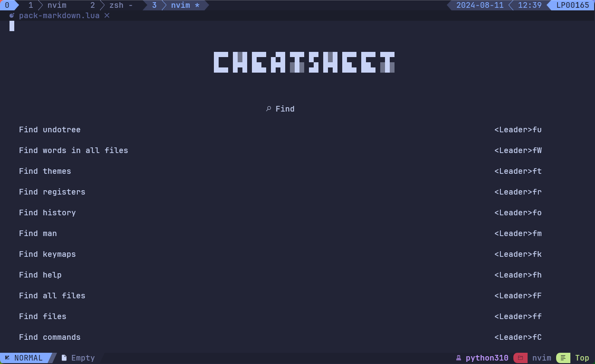
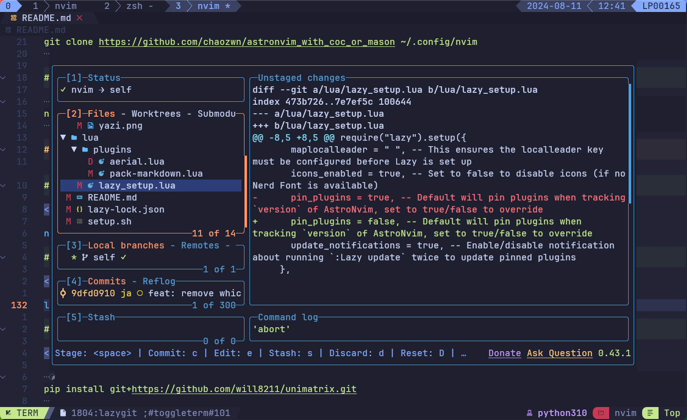

# AstroNvimV5 Config

<!--toc:start-->

- [AstroNvimV5 Config](#astronvimv5-config)
  - [Support neovim version](#support-neovim-version)
  - [Features](#features)
  - [🛠️ Installation](#🛠️-installation)
    - [The system should supports these commands](#the-system-should-supports-these-commands)
    - [Recommend install](#recommend-install)
    - [Note: for rust development](#note-for-rust-development)
    - [Make a backup of your current nvim and shared folder](#make-a-backup-of-your-current-nvim-and-shared-folder)
    - [Clone the repository](#clone-the-repository)
    - [Start Neovim](#start-neovim)
  - [Tips](#tips)
    - [NVcheatsheet](#nvcheatsheet)
    - [Use Lazygit](#use-lazygit)
    - [Install unimatrix](#install-unimatrix)
    - [Neovim requirements](#neovim-requirements)
    - [Markdown Image Paste](#markdown-image-paste)
    - [Input Auto Switch](#input-auto-switch)
    - [Support for neovide](#support-for-neovide)
    - [Support Lazydocker](#support-lazydocker)
  - [General Mappings](#general-mappings) - [Signature Help](#signature-help)
  <!--toc:end-->

## Support neovim version

neovim >= `0.11`, recommend `0.11.0`

## Features

this config supports development in `TypeScript`,`Python`,`Go`,`Rust`,`markdown`,`C/Cpp`,`Flutter`,etc.

- **_`Typescript`_**: `vtsls` work with `volar2`
- **_`Python`_**: `basedpyright`
- **_`Go`_**: `gopher.nvim` _-- support go zero framework_
- **_`Markdown`_**: `iamcco/markdown-preview.nvim`,
- **_`Rust`_**: `mrcjkb/rustaceanvim`
- **_`Flutter`_**: `flutter-nvim/flutter-tools.nvim`
- **_`C/C++`_**:`clangd+clang-format+clazy-standalone+neocmake+cmake-lint+cmake-format`

## 🛠️ Installation

### The system should supports these commands

`npm`,`rustc`,`go`

### Recommend install

See `scripts/setup_arch_linux.sh` and `setup_mac.sh` for required prerequisites

### Note: for rust development

> [!NOTE]
> rustup and mason's installation of rust-analzyer are different and may cause some [bugs](https://github.com/rust-lang/rust-analyzer/issues/17289), manual installation is recommended.

```
rustup component add rust-analyzer
```

### Make a backup of your current nvim and shared folder

```bash
mv ~/.config/nvim ~/.config/nvim.bak
mv ~/.local/share/nvim ~/.local/share/nvim.bak
mv ~/.local/state/nvim ~/.local/state/nvim.bak
mv ~/.cache/nvim ~/.cache/nvim.bak
```

### Clone the repository

```bash
git clone https://github.com/CWndpkj/nvimConfigs.git ~/.config/nvim
```

### Start Neovim

```bash
nvim
```

## Tips

### NVcheatsheet

`<F2>`



### Use Lazygit

`<leader>tl`



### Install unimatrix

`<Leader>tm`

### Neovim requirements

```bash
npm install -g neovim
pip install pynvim
```

### Markdown Image Paste

```bash
pip install pillow
```

### Input Auto Switch

```bash
brew tap daipeihust/tap
brew install im-select
im-select
```

run `im-select` & copy result to `im-select.lua`

```lua
return {
  "chaozwn/im-select.nvim",
  lazy = false,
  opts = {
    default_main_select = "com.sogou.inputmethod.sogou.pinyin", -- update your input method
    set_previous_events = { "InsertEnter", "FocusLost" },
  },
}
```

### Support for neovide

```bash
brew install neovide
neovide .
```

### Support Lazydocker

tigger command: `<leader>td`

```bash
brew install lazydocker
```

## General Mappings

| Action                      | Mapping               | Mode |
| --------------------------- | --------------------- | ---- |
| Leader key                  | <kbd>Space</kbd>      | n    |
| Resize up                   | <kbd>Ctrl+Up</kbd>    | n    |
| Resize Down                 | <kbd>Ctrl+Down</kbd>  | n    |
| Resize Left                 | <kbd>Ctrl+Left</kbd>  | n    |
| Resize Right                | <kbd>Ctrl+Right</kbd> | n    |
| Up Window                   | <kbd>Ctrl+k</kbd>     | n    |
| Down Window                 | <kbd>Ctrl+j</kbd>     | n    |
| Left Window                 | <kbd>Ctrl+h</kbd>     | n    |
| Right Window                | <kbd>Ctrl+l</kbd>     | n    |
| Force Write                 | <kbd>Ctrl+s</kbd>     | n    |
| Force Quit                  | <kbd>Ctrl+q</kbd>     | n    |
| New File                    | <kbd>Leader+n</kbd>   | n    |
| Close Buffer                | <kbd>Leader+b+d</kbd> | n    |
| Next Tab (real vim tab)     | <kbd>Tab</kbd>        | n    |
| Previous Tab (real vim tab) | <kbd>Shift+Tab</kbd>  | n    |
| Comment                     | <kbd>Control+/</kbd>  | n    |
| Horizontal Split            | <kbd>/</kbd>          | n    |
| Vertical Split              | <kbd>\|</kbd>         | n    |
| Open task menu              | <kbd>Leader+n</kbd>   | n    |

---

Copilot Mappings
| Action | Mapping | Mode |
| ------------------------ | --------------------- | ---- |
| Open chat panel | <kbd>Leader+n+n</kbd> | n |
| Accept inline suggestion | <kbd>Ctrl+.</kbd> | n |

---

Terminal Mappings
| Action | Mapping | Column3 |
| ------------- | -------------- | -------------- |
| Toggle Terminal | <kbd>F7</kbd> | n |
| Close Terminal | <kbd>Control+q</kbd>|n|
| Split Terminal | <kbd>Control+F7</kbd> |n|

### Signature Help

_vim.lsp.buf.hover()_ `KK` jump into signature help float window

> [!TIP]
> Displays hover information about the symbol under the cursor in a floating window. Calling the function twice will jump into the floating window.
